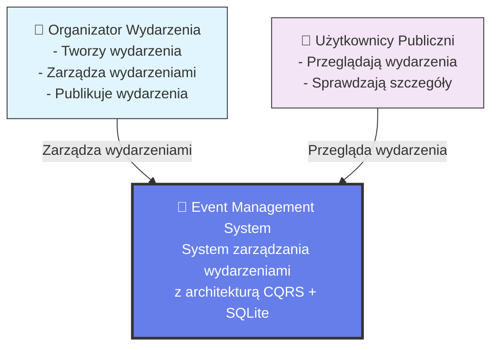
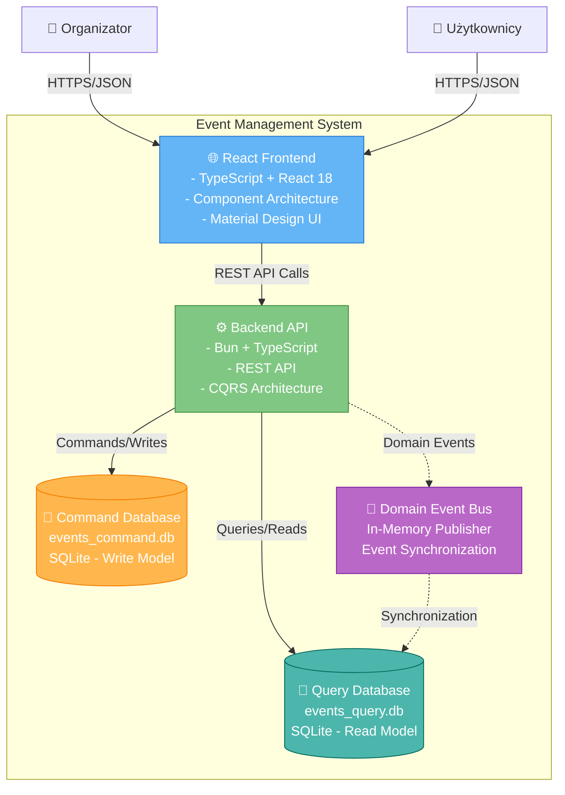
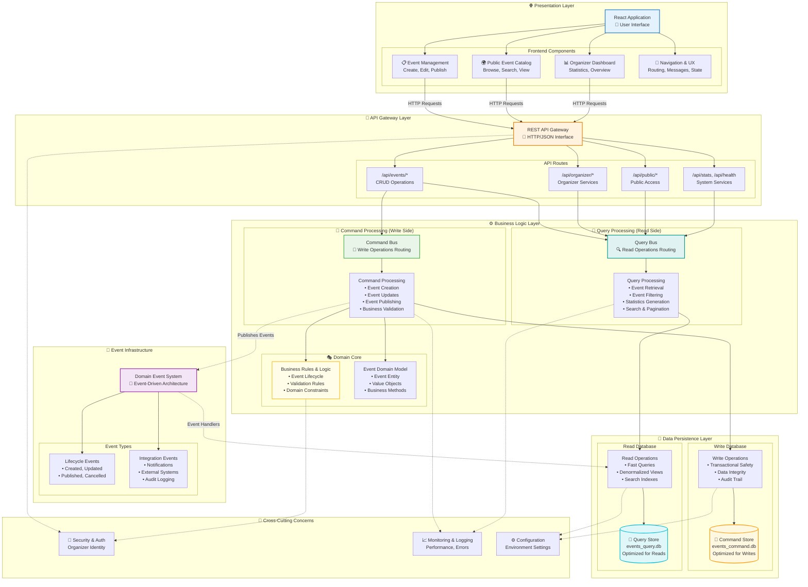
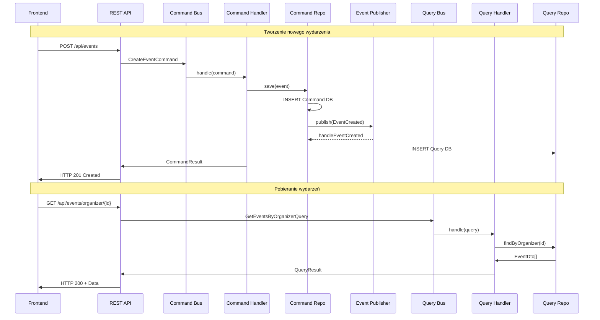
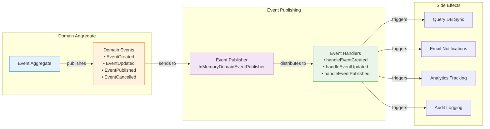
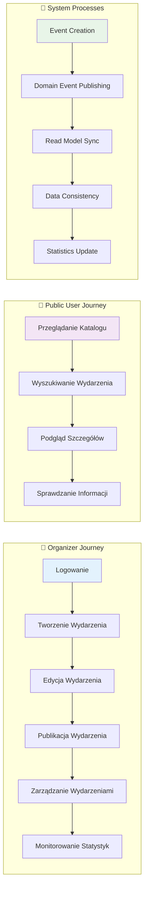
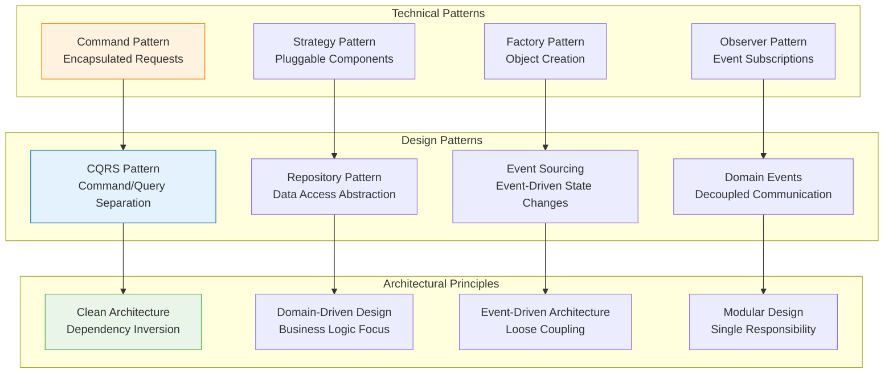
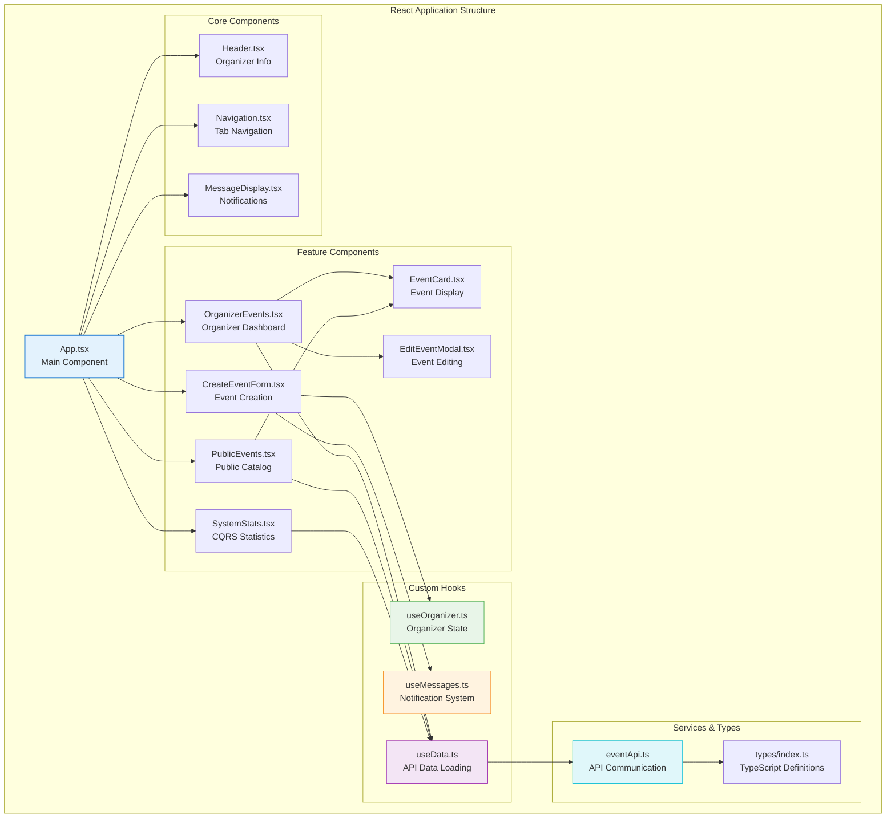

# Event Management System - Diagramy C4

## C1 - Context Diagram (Kontekst systemu)



## C2 - Container Diagram (Kontenery systemu)



## C3 - Component Diagram (Holistyczny widok aplikacji)



## Przepływ danych w architekturze CQRS



## Domain Events Flow



## Kluczowe przepływy funkcjonalne



## Kluczowe cechy architektury

### ✅ **CQRS (Command Query Responsibility Segregation)**
- **Command Side**: Operacje zapisu (CREATE, UPDATE, DELETE)
- **Query Side**: Operacje odczytu (GET, LIST, SEARCH)  
- **Separacja**: Różne modele danych dla zapisów i odczytów
- **Optymalizacja**: Każda strona może być niezależnie skalowana

### ✅ **Domain Events & Event Sourcing**
- **EventCreated**: Nowe wydarzenie utworzone
- **EventUpdated**: Wydarzenie zaktualizowane  
- **EventPublished**: Wydarzenie opublikowane
- **EventCancelled**: Wydarzenie anulowane
- **Event-Driven Sync**: Asynchroniczna synchronizacja między modelami

### ✅ **Clean Architecture & DDD Patterns**
- **Layered Architecture**: Separation of concerns
- **Domain-Driven Design**: Business logic w centrum
- **Repository Pattern**: Abstrakcja dostępu do danych
- **Command/Query Pattern**: Segregacja operacji

### ✅ **Dual Database Architecture**
- **events_command.db**: Optymalizowana do zapisów (ACID, transactions)
- **events_query.db**: Optymalizowana do odczytów (indexy, denormalizacja)
- **Eventual Consistency**: Synchronizacja przez domain events
- **Performance**: Różne strategie optymalizacji dla każdego przypadku

### ✅ **React Frontend Architecture**
- **Component-Based**: Modularna struktura UI
- **Custom Hooks**: Logika biznesowa oddzielona od prezentacji
- **Type Safety**: TypeScript dla całej aplikacji
- **State Management**: React hooks + local state

### 🔄 **Event-Driven Synchronization**
```
Command → Domain Event → Event Handler → Query Model Update
```

### 📐 **Architectural Patterns Applied**



## Architektura React Frontend



Diagramy pokazują kompletną architekturę systemu od poziomu kontekstu biznesowego (C1), przez kontenery techniczne (C2), aż po szczegółowe komponenty i ich interakcje (C3).